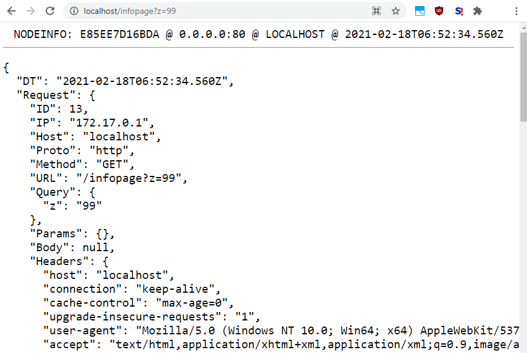

# 🔍 NODEINFO: Whoami Microservice 🔍
### Node Runtime / Docker Instance / Host Environment / Debug Info

---

#### <code><a href='https://github.com/cogsmith/nodeinfo'> [GITHUB REPO]</a></code>

#### <code><a href='https://hub.docker.com/r/cogsmith/nodeinfo'>🐳 [DOCKER IMAGE]</a></code>

#### <code><a href='https://github.com/cogsmith/nodeinfo/blob/main/app.js'>🧾 [VIEW APP SOURCE CODE]</a></code>

#### <code><a href='https://github.com/cogsmith/nodeinfo/projects/1'>📅 [PROJECT TRACKER BOARD]</a></code>

---

<!--  -->

---

---
### No Server Show Message And Exit

~~~
docker run --rm --name nodeinfo cogsmith/nodeinfo

# NODEINFO: 9AEF78AB1BA5 @ 2021-02-18T07:12:24.421Z
~~~

---

### Local Web Server @ Port 99

~~~
docker run -d --rm --name nodeinfo99 --env PORT=9 -p 127.0.0.1:99:9 cogsmith/nodeinfo ; sleep 1 ; curl -L http://127.0.0.1:99 ; curl http://127.0.0.1:99/info

# NODEINFO: 3690BE09C2DD @ 0.0.0.0:80 @ 127.0.0.1:99 @ 2021-02-18T07:12:35.277Z
# {JSON:{DT:...}}
~~~

---

### Public Web Server @ Port 80

~~~
docker run -d --rm --name nodeinfo80 --env PORT=9 -p 0.0.0.0:80:9 cogsmith/nodeinfo ; sleep 1 ; curl -L http://localhost ; curl http://localhost/info

# NODEINFO: 80A831D99043 @ 0.0.0.0:80 @ LOCALHOST @ 2021-02-18T07:12:43.927Z
# {JSON:{DT:...}}
~~~

---

### Clean Up

~~~
docker stop nodeinfo ; docker stop nodeinfo99 ; docker stop nodeinfo80 ; docker rm nodeinfo ; docker rm nodeinfo99 ; docker rm nodeinfo80 ; docker rmi cogsmith/nodeinfo
~~~

---